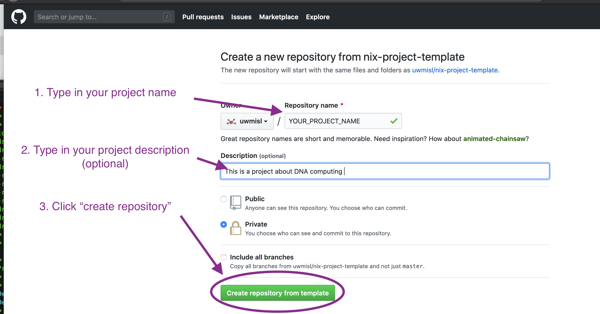

# nix-project-template
A simple template for setting up your experiment/project with Nix package management


## Get Started 

You can make your Nix-friendly project from Github, or from the command line: 

### From Git

From the command line, navigate to where you'd like your repository created.
Assign the variable `MISL_MY_PROJECT_NAME` your project name e.g.

```
MISL_MY_PROJECT_NAME="ProteinFolder"
```
Then run the following
```
git clone https://github.com/uwmisl/nix-project-template.git
git init $MISL_MY_PROJECT_NAME
rsync -ar --exclude=".git" ./nix-project-template/ "./${MISL_MY_PROJECT_NAME}"
rm -rf ./nix-project-template
```

### From GitHub 

- From this page, create your project by clicking "Use this template" 


- Then create your project as you normally would.



-  All the files and folders you need will be automatically created. 

## Bootstrap the project 

- Once your project repository is created, navigate to the project directory 

- run `bash bootstrap_dev.sh`

Now you're good to go!
